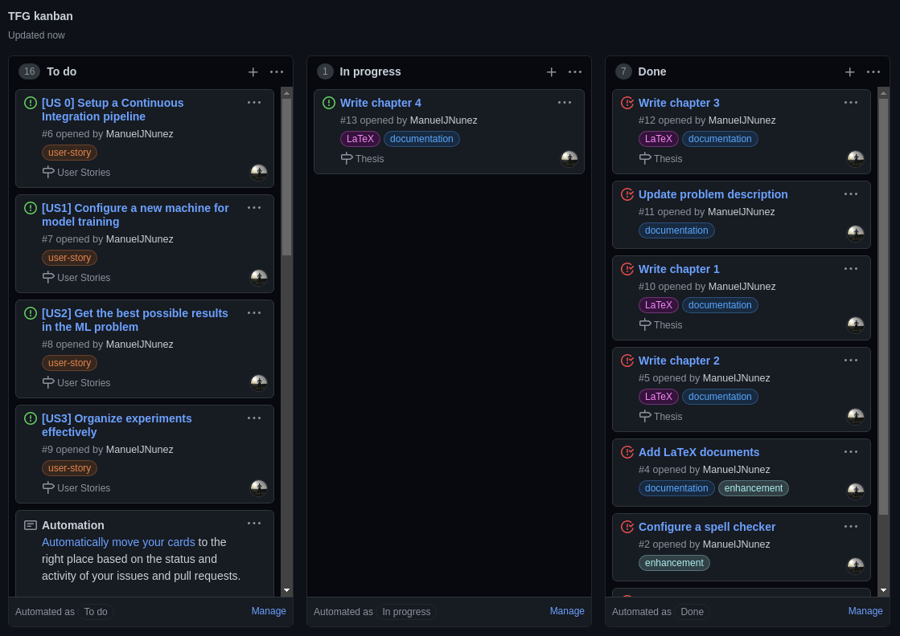
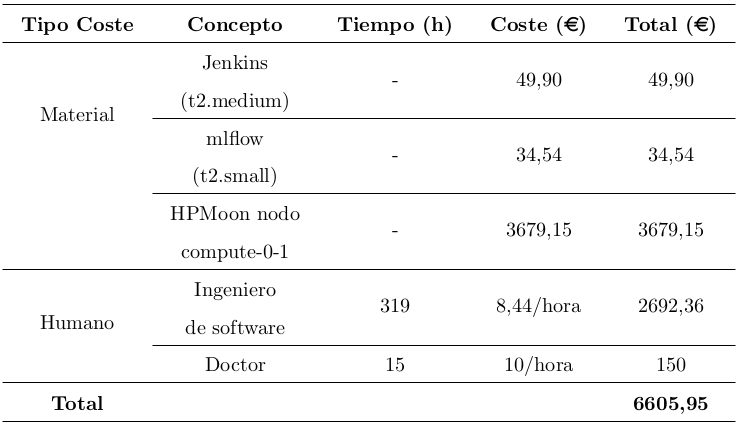
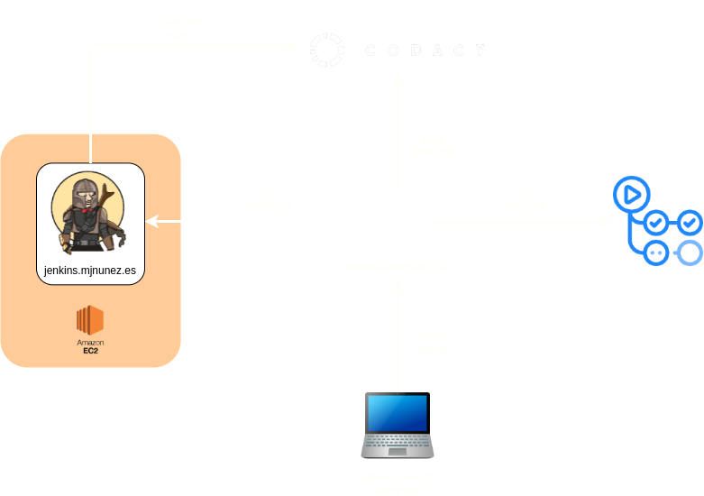
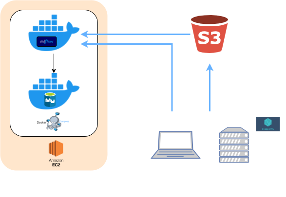
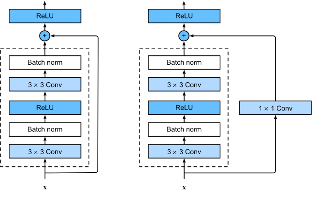
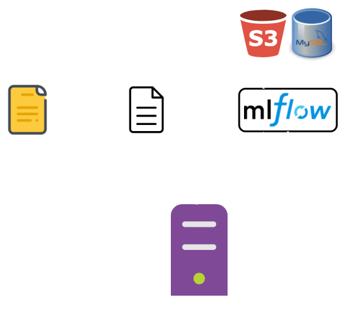
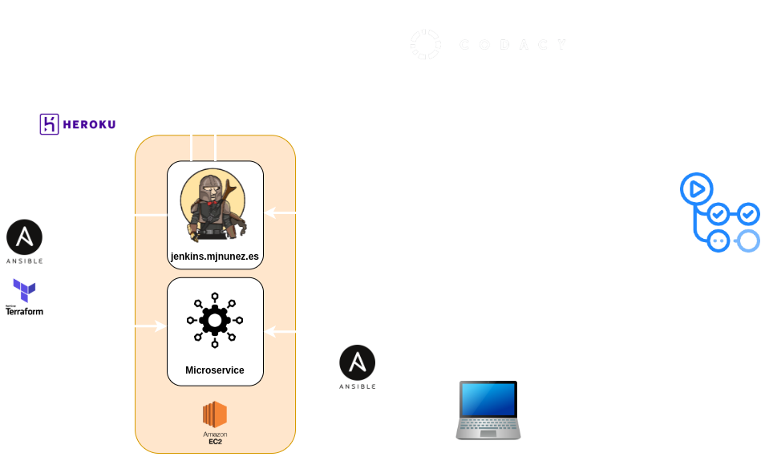

<!-- _class: lead -->

#### Desarrollo de modelos de Machine Learning aplicando MLOps


Manuel Jesús Núñez Ruiz

---

<style scoped>
section {
  font-size: 32px;
}
</style>

# Índice

1. Objetivos
2. DevOps y MLOps
3. Descripción del problema
4. Planificación y presupuesto
5. Herramientas utilizadas
6. Infraestructura utilizada
7. Pruebas y resultados
8. Despliegue
9. Conclusiones y trabaos futuros.

<!-- footer: Manuel Jesús Núñez Ruiz -->

---

<!-- _class: lead -->

# 1. Objetivos

---

# Objetivos

- Llevar un control de los experimentos realizados.
- Obtener los mejores resultados posibles mediante el uso de hiperparámetros óptimos.
- Comprobar la validez de un modelo mediante *tests* unitarios (TDD aplicado al ML).
- Diseñar un despliegue ágil de modelos.
- Permitir la reproducibilidad.

<!-- _footer: Sección 1: Objetivos -->
---

<!-- _class: lead -->

# 2. DevOps y MLOps

---

# DevOps

- *Development* + *Operations*
- Integración entre desarrolladores de sofware y *sysadmins*.
- Software con mayor calidad, menor coste y una altísima frecuencia de *releases*.

<!-- footer: Sección 2: DevOps y MLOps -->
  
---

# DevOps

- Prácticas DevOps:
  - CI/CD
  - Control de versiones
  - Infraestructura como Código
  - Monitorización

---

# DevOps
### CI/CD

- **Continuous Integration (CI).** Automatizar la integración de los cambios del código. Se basa en el uso de herramientas automáticas para verificar que el nuevo código es correcto.
- **Continuous Deployment (CD).** Automatización de la puesta en producción de los nuevos cambios.

---

# DevOps
### Control de versiones

Registra los cambios realizados en los ficheros fuentes a lo largo del tiempo, permitiendo recuperar versiones específicas más adelante.

<br/>


---

# DevOps
### Infraestructura como Código

- Permite la gestión y preparación la infraestructura con código.
- Ventajas:
  - Ahorro de tiempo y costes.
  - Facilita la distribución y reproducibilidad.

---

# DevOps

### Monitorización

- Registrar en tiempo real el rendimiento y estado de las aplicaciones.
- Objetivo: detectar errores lo antes posible.
- Necesario visualizar:
  - Hardware subyacente.
  - Aplicación en ejecución.

---

# MLOps

- Disciplina reciente.
- Aplicar las prácticas de DevOps al desarrollo de sistemas de ML.
- Problema adicional:
  - Administración de modelos.
  - Administración de hiperparámetros y métricas.
  - Reproducibilidad.

---

<!-- _class: lead -->

# 3. Descripción del problema

<!-- _footer: Manuel Jesús Núñez Ruiz -->

---

<!-- _class: invert -->

# Descripción del problema

- Concepto importante: cascada atmosférica extensa (EAS).
- Una partícula muy cargada proveniente del cosmos entra en contacto con la atmósfera.
- Interés: investigar las fuentes de radiación del universo.


<!-- footer: Sección 3: Descripción del problema -->

---

<!-- _class: invert -->

# Descripción del problema

- Captura de información con Water Cherenkov Detectors en observatorio SWGO.
- Tanques de agua ultrapura con fotomultiplicadores en el fondo.
- Se suelen colocar siguiendo un *layout*.


---

<!-- _class: invert -->

# Descripción del problema

- Construcción por fases.
- Altura mínima 4.4km.
- Coste estimado 40-50 M€.
- Tiempo de funcionamiento esperado: 20 años.
- Para evitar derroches se han simulado datos usando CORSIKA.


---

<!-- _class: invert -->

# Descripción del problema


---

# Descripción del problema

<!-- _class: invert -->

- Los datos vienen divididos en dos subconjuntos:
  - Conjunto de entrenamiento (44.971 muestras):
    - Clase 0: 22.481 muestras.
    - Clase 1: 22.490 muestras.
  - Conjunto de pruebas (14.989 muestras):
    - Clase 0: 7.493 muestras.
    - Clase 1: 7.496 muestras.

---

<!-- _class: lead -->

# 4. Planificación y presupuesto

<!-- _footer: Manuel Jesús Núñez Ruiz -->

---

## Planificación y presupuesto
#### Planificación



<!-- Sección 4: Planificación y presupuesto -->

---

## Planificación y presupuesto
#### Presupuesto



---

<!-- _class: lead -->

# 5. Herramientas utilizadas

<!-- _footer: Manuel Jesús Núñez Ruiz -->

---

<!-- _class: invert -->

## Herramientas utilizadas
#### Lenguaje de programación

- Ventajas:
  - Fácil de aprender
  - Lenguaje de propósito general.
  - Gran ecosistema para ciencia de datos y desarrollo.
- Desventajas:
  - Más lento que otros lenguajes.


<!-- footer: Sección 5: Herramientas utilizadas -->

---

<!-- _class: invert -->

## Herramientas utilizadas
#### Gestor de dependencias

- Usado para registrar e instalar las dependencias en un *virtual environment*.
- Dos alternativas:
  - Poetry.
  - Pipenv.
- Elegido Poetry tras la comparación realizada (ver Subsección 3.1.2 de la memoria).


---

<!-- _class: invert -->

## Herramientas utilizadas
#### Gestor de tareas

- Necesario para registrar todas las tareas que se tienen que llevar a cabo para ejecutar los tests, compilar, ejecutar...
- Se especifican en un fichero usando algún lenguaje.
- El gestor de tareas se encarga de ejecutar ese código.

```python
@task
def test(c):
    c.run("coverage run --source=src/ml -m pytest", pty=True)
```

---

<!-- _class: invert -->

## Herramientas utilizadas
#### Gestor de tareas

- Varias alternativas:
  - *Poe the poet* o *taskipy* (Bash).
  - Invoke (Python).
- Elección: Invoke
  - Mayor portabilidad.
  - Claridad y sencillez en la sintaxis.

---

<!-- _class: invert -->

## Herramientas utilizadas
#### Plataforma de CI/CD

- Plataforma elegida: Jenkins.
  - *Self-hosted*.
  - Muy personalizable.
  - No tener que preocuparme de los créditos.
  - Plan de eduación AWS.
  - Interfaz compleja.


---

<!-- _class: invert -->

## Herramientas utilizadas
#### Plataforma de CI/CD

- Otra plataforma elegida: GH Actions.
  - No es *self-hosted*.
  - Gratis (por ahora).
  - Usado para tests secundarios.


---

<!-- _class: invert -->

## Herramientas utilizadas
#### Linters y static analysis

- Pylint
  - *static analyzer*.
  - Fuerza a seguir estándares de estilo de código.
- Black
  - Evita el *código espagueti*.
  - Fuerza el estilo del *PEP 8*.


---

<!-- _class: invert -->

## Herramientas utilizadas
#### Aprovisionamiento

- Elección: Terraform.
  - Usa un DSL llamado HCL, pero
  - Mejor documentación.
  - Mayor comunidad.


---

<!-- _class: invert -->

## Herramientas utilizadas
#### Framework MLOps

- Permite configurar experimentos en ficheros con formato YAML.
- Usa *mlfow* para registrar:
  - Hiperparámetros.
  - Métricas.
  - Artefactos.
- Solucionados problemas MLOps :rocket:


---

<!-- _class: lead -->

# 6. Infraestructura utilizada

<!-- _footer: Manuel Jesús Núñez Ruiz -->

---

# Infraestructura utilizada

#### Infraestructura de test



<!-- footer: Sección 6: Infraestructura utilizada -->

---

# Infraestructura utilizada

#### Infraestructura de test

- Jenkins:
  - Aprovisionado con Terraform.
  - Responsabilidades:
    - Instalar dependencias.
    - Ejecutar tests (unitarios y de cobertura).
    - Enviar resultados tests de cobertura a *Codacy*.
    - Checkear estilo y formato con *Pylint* y *Black*.

---

# Infraestructura utilizada

#### Infraestructura de test

- Codacy:
  - Analiza el repositorio entero (no solo el código fuente).
  - Lo evalúa con una calificación entre A y F.
  - Registra resultados de tests de cobertura.
  - Permite mostrar *badges* en GitHub.


---

# Infraestructura utilizada

#### Infraestructura de test

- GitHub Actions:
  - Responsabilidades:
    - Comprobar existencia de ficheros básicos (LICENSE, README, gitignore).
    - Comprobar ortografía.
    - Ejecutar *tests* en varias versiones de *Python*.

---

# Infraestructura utilizada

#### Infraestructura de entrenamiento



---

<!-- _class: lead -->

# 7. Pruebas y resultados

<!-- _footer: Manuel Jesús Núñez Ruiz -->

---

<!-- _class: invert -->

## Pruebas y resultados

#### Convolutional Autoencoder

- Comprime la imagen a una dimensión menor.
- Función objetivo:
  - $\tilde{\mathcal{L}} = \mathcal{L}(y,\hat{y}) + \lambda R(x,\hat{x})$
  - $\mathcal{L}(y,\hat{y}) = CrossEntropy(y,\hat{y})$
  - $R(x,\hat{x}) = MSE(x,\hat{x})$


<!-- footer: Sección 7: Pruebas y resultados -->

---

<!-- _class: invert -->

<style scoped>
code {
  font-size: 11px;
}
</style>

## Pruebas y resultados

#### Convolutional Autoencoder

```yaml
name: "CAE"
kind: group
num_trials: 1
resources_per_worker:
  cpu: 1.0
  gpu: 1.0

params:
  epochs: 5
  seed: 2342

param_space:
  lr: loguniform(0.0001, 0.01)
  reg: loguniform(0.0001, 0.1)
  bs: randint(32, 256)
  first_conv_out_channels: randint(1, 10)
  depth: randint(2, 4)
  latent_size: randint(10, 100)
  optimizer: choice(['adam', 'sgd'])
  normalize: choice(['yes', 'no'])

metric:
  name: test_f1
  direction: maximize

run:
  - src/cae.py
```

---

<!-- _class: invert -->

## Pruebas y resultados

#### Convolutional Classifier

- Basado en LeNet-5.
- Función objetivo:
  - $CrossEntropy(y,\hat{y})$


---

<!-- _class: invert -->

<style scoped>
code {
  font-size: 11px;
}
</style>

## Pruebas y resultados

#### Convolutional Classifier

```yaml
name: "Simple CNN"
kind: group
num_trials: 1
resources_per_worker:
  cpu: 1.0
  gpu: 1.0

params:
  epochs: 5
  seed: 2342

param_space:
  bs: randint(32, 256)
  lr: loguniform(0.0001, 0.01)
  optimizer: choice(['adam', 'sgd'])
  out_channels:
    - randint(2, 20)
    - randint(2, 20)
  normalize: choice(['yes', 'no'])

metric:
  name: test_f1
  direction: maximize

run:
  - src/convnet.py
```

---

<!-- _class: invert -->

## Pruebas y resultados

#### Residual Network

- Muy popular en la clasificación de imágenes.
- Concatenación de varios ResBlocks.
- Función objetivo:
  - $CrossEntropy(y,\hat{y})$



---

<!-- _class: invert -->

<style scoped>
code {
  font-size: 8.8px;
}
</style>

## Pruebas y resultados

#### Residual Network

```yaml
name: "ResNet"
kind: group
num_trials: 1
resources_per_worker:
  cpu: 1.0
  gpu: 1.0

params:
  epochs: 5
  seed: 2342

param_space:
  lr: loguniform(0.0001, 0.01)
  reg: loguniform(0.0001, 0.1)
  bs: randint(32, 256)
  number_of_blocks:
    - randint(2, 6)
    - randint(2, 6)
    - randint(2, 6)
    - randint(2, 6)
  num_channels:
    - randint(8, 32)
    - randint(32, 64)
    - randint(64, 128)
    - randint(128, 256)
    - randint(256, 512)
  optimizer: choice(['adam', 'sgd'])
  normalize: choice(['yes', 'no'])

metric:
  name: test_f1
  direction: maximize

run:
  - src/resnet.py
```

---

<!-- _class: invert -->

## Pruebas y resultados

#### Varitional Autoencoder

- Interesante comparar redes clásicas con convolucionales.
- Comprime la imagen a una dimensión menor.
- Función objetivo:
  - Igual que la del Convolutional Autoencoder


---

<!-- _class: invert -->

<style scoped>
code {
  font-size: 10.3px;
}
</style>

## Pruebas y resultados

#### Varitional Autoencoder

```yaml
name: "VAE"
kind: group
num_trials: 1
resources_per_worker:
  cpu: 1.0
  gpu: 1.0

params:
  epochs: 5
  seed: 2342

param_space:
  lr: loguniform(0.0001, 0.01)
  reg: loguniform(0.0001, 0.1)
  bs: randint(32, 256)
  autoencoder_sizes:
    - randint(500, 1000)
    - randint(100, 500)
    - randint(50, 100)
    - randint(10, 50)
  optimizer: choice(['adam', 'sgd'])
  normalize: choice(['yes', 'no'])

metric:
  name: test_f1
  direction: maximize

run:
  - src/vae.py
```

---

<!-- _class: invert -->

<style>
table {
  margin-left: auto;
  margin-right: auto;
  font-size: 34px;
}
</style>

## Pruebas y resultados

#### Resultados

|         **Modelo**        |   **Valor máximo<br/>*test_f1***  |   **Valor medio<br/>*test_f1***  |  **Std. Dev.<br/>*test_f1***  |
|:-------------------------:|:---------------------------------:|:--------------------------------:|:-----------------------------:|
| Convolutional Autoencoder |               0.988               |                0.853             |             0.199             |
|  Convolutional Classifier |               0.991               |                0.910             |             0.120             |
|      Residual Network     |               0.987               |                0.842             |             0.216             |
|   Varitional Autoencoder  |               0.982               |                0.429             |             0.414             |

---

## Pruebas y resultados

#### Profiling (entrenamiento)

<!-- _class: invert -->

|         **Modelo**        |  **Memoria usada**  |
|:-------------------------:|:-------------------:|
| Convolutional Autoencoder |       3.56 GiB      |
|  Convolutional Classifier |       3.61 GiB      |
|      Residual Network     |       3.14 GiB      |
|   Varitional Autoencoder  |       3.15 GiB      |

---

<!-- _class: lead -->

# 8. Despliegue

<!-- _footer: Manuel Jesús Núñez Ruiz -->

---

## Despliegue
#### Ciclo de vida de un modelo



<!-- footer: Sección 8: Despliegue -->

---

## Despliegue
#### Infraestructura despliegue



---

<!-- _class: lead -->

# 9. Conclusiones y trabajos futuros

<!-- _footer: Manuel Jesús Núñez Ruiz -->

---

## Conclusiones y trabajos futuros
#### Conclusiones

- Todo ha sido implementado usando software libre.
- Toda la infraestructura es reproducible.
- Gracias al uso de *mlflow*:
  - Se puede llevar un control de los experimentos.
  - Se puede utilizar para despliegue ágil de modelos.
- Gracias al uso de *SnapperML* se puede ejecutar los experimentos en otra máquina con una sola orden.
- Pero aún hay mas...

<!-- footer: Sección 9: Conclusiones y trabajos futuros -->

---

## Conclusiones y trabajos futuros
#### Trabajos futuros

- Usar herramientas de orquestación para:
  - Permitir la reproducibilidad de la infraestructura con una orden.
  - Pruebas de concepto despliegue (contexto del observatorio).
- Añadir infraestructura monitorización y *logging*.
- Tests de infraestructura.
- Ejecutar *tests* en otras plataformas (Windows, MacOSX).
- Probar los modelos con los datos del simulador EPOS.

---

<!-- _color: black -->
<!-- _backgroundColor: #00FFCD -->

<style scoped>
footer {
  color: black;
}
</style>

# Fin

Manuel Jesús Núñez Ruiz ([@ManuelJNunez](https://github.com/ManuelJNunez))

https://github.com/ManuelJNunez/TFG

<!-- _footer: Fin -->
