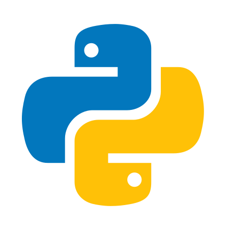

<!-- _class: lead -->

#### Desarrollo de modelos de Machine Learning aplicando MLOps


Manuel Jesús Núñez Ruiz

---

# Índice

1. Objetivos
2. DevOps y MLOps
3. Descripción del problema
4. Herramientas utilizadas
5. Modelos de Deep Learning
6. Infraestructura utilizada
7. Resultados obtenidos
8. Despliegue

<!-- footer: Manuel Jesús Núñez Ruiz -->

---

<!-- _class: lead -->

# 1. Objetivos

---

# Objetivos

- Llevar un control de los experimentos realizados.
- Obtener los mejores resultados posibles mediante el uso de hiperparámetros óptimos.
- Comprobar la validez de un modelo mediante *tests* unitarios (TDD aplicado al ML).
- Despliegue ágil de modelos.
- Permitir la reproducibilidad.

<!-- _footer: Sección 1: Objetivos -->
---

<!-- _class: lead -->

# 2. DevOps y MLOps

---

# DevOps

- *Development* + *Operations*
- Integración entre desarrolladores de sofware y *sysadmins*.
- Software con mayor calidad, menor coste y una altísima frecuencia de *releases*.

<!-- footer: Sección 2: DevOps y MLOps -->
  
---

# DevOps

- Prácticas DevOps:
  - CI/CD
  - Control de versiones
  - Infraestructura como Código
  - Monitorización

---

# DevOps
### CI/CD

- **Continuous Integration (CI).** Automatizar la integración de los cambios del código. Se basa en el uso de herramientas automáticas para verificar que el nuevo código es correcto.
- **Continuous Deployment (CD).** Automatización de la puesta en producción de los nuevos cambios.

---

# DevOps
### Control de versiones

Registra los cambios realizados en los ficheros fuentes a lo largo del tiempo, permitiendo recuperar versiones específicas más adelante.

<br/>


---

# DevOps
### Infraestructura como Código

- Permite la gestión y preparación la infraestructura con código.
- Ventajas:
  - Ahorro de tiempo y costes.
  - Facilita la distribución y reproducibilidad.

---

# DevOps

### Monitorización

- Visualizar en tiempo real el rendimiento y estado de las aplicaciones.
- Objetivo: detectar errores lo antes posible.
- Necesario visualizar:
  - Hardware subyacente.
  - Aplicación en ejecución.

---

# MLOps

- Aplicar las prácticas de DevOps al desarrollo de sistemas de ML.
- Problema adicional:
  - Administración de modelos.
  - Administración de hiperparámetros y métricas.
  - Reproducibilidad.

---

<!-- _class: lead -->

# 3. Descripción del problema

<!-- _footer: Manuel Jesús Núñez Ruiz -->

---

<!-- _class: invert -->

# Descripción del problema

- Concepto importante: cascada atmosférica extensa.
- Una partícula muy cargada proveniente del cosmos entra en contacto con la atmósfera.
- Interés: investigar las fuentes de radiación del universo.


<!-- footer: Sección 3: Descripción del problema -->

---

<!-- _class: invert -->

# Descripción del problema

- Captura de información con Water Cherenkov Detectors.
- Tanques de agua ultrapura con fotomultiplicadores en el fondo.
- Se suelen colocar siguiendo un *layout*.


---

<!-- _class: invert -->

# Descripción del problema

- Altura mínima 4.4km.
- Tiempo de funcionamiento esperado: 20 años.
- Coste estimado 40-50 M€.
- Construcción por fases.
- Para evitar derroches se han simulado datos usando CORSIKA.


---

<!-- _class: invert -->

# Descripción del problema


---

# Descripción del problema

<!-- _class: invert -->

- Los datos vienen divididos en dos subconjuntos:
  - Conjunto de entrenamiento (44.971 muestras):
    - Clase 0: 22.481 muestras.
    - Clase 1: 22.490 muestras.
  - Conjunto de pruebas (14.989 muestras):
    - Clase 0: 7.493 muestras.
    - Clase 1: 7.496 muestras.

---

<!-- _class: lead -->

# 4. Herramientas utilizadas

<!-- _footer: Manuel Jesús Núñez Ruiz -->

---

<!-- _class: invert -->

## Herramientas utilizadas
#### Lenguaje de programación

- Ventajas:
  - Fácil de aprender
  - Lenguaje de propósito general.
  - Gran ecosistema para ciencia de datos y desarrollo.
- Desventajas:
  - Más lento que otros lenguajes.



<!-- footer: Sección 4: Herramientas utilizadas -->

---

<!-- _class: invert -->

## Herramientas utilizadas
#### Gestor de dependencias

- Usado para registrar e instalar las dependencias en un *virtual environment*.
- Dos alternativas:
  - Poetry.
  - Pipenv.
- Elegido Poetry tras la comparación realizada (ver Subsección 3.1.2 de la memoria).

---

<!-- _class: invert -->

<style scoped>
section {
  font-size: 29px
}
</style>

## Herramientas utilizadas
#### Gestor de dependencias


```toml
[tool.poetry]
name = "TFG"
version = "0.0.1"
description = "Dependency file for this project :)"
authors = ["ManuelJNunez <manueljesusnunezruiz@gmail.com>"]
license = "GPL-3.0"

[tool.poetry.dependencies]
python = "^3.7"

[tool.poetry.dev-dependencies]

[build-system]
requires = ["poetry-core>=1.0.0"]
build-backend = "poetry.core.masonry.api"
```

---

<!-- _class: invert -->

## Herramientas utilizadas
#### Gestor de tareas

- Necesario para registrar todas las tareas que se tienen que llevar a cabo para ejecutar los tests, compilar, ejecutar...
- Se especifican en un fichero usando algún lenguaje.
- El gestor de tareas se encarga de ejecutar ese código.

```python
@task
def test(c):
    c.run("coverage run --source=src/ml -m pytest", pty=True)
```

---

<!-- _class: invert -->

## Herramientas utilizadas
#### Gestor de tareas

- Varias alternativas:
  - *Poe the poet* o *taskipy* (Bash).
  - Invoke (Python).
- Elección: Invoke
  - Mayor portabilidad.
  - Claridad y sencillez en la sintaxis.

---

<!-- _class: invert -->

## Herramientas utilizadas
#### Plataforma de CI/CD

- Plataforma elegida: Jenkins.
  - *Self-hosted*.
  - Muy personalizable.
  - No tener que preocuparme de los créditos.
  - Plan de eduación AWS.
  - Interfaz compleja.


---

<!-- _class: invert -->

## Herramientas utilizadas
#### Plataforma de CI/CD

- Otra plataforma elegida: GH Actions.
  - Gratis (por ahora).
  - Tests secundarios: existencia de archivos y ortografía.
  - Ejecución de *tests* en varias versiones de python.


---

<!-- _class: invert -->

## Herramientas utilizadas
#### Linters y static analysis

- Pylint
  - *static analyzer*.
  - Fuerza a seguir estándares de estilo de código.
- Black
  - Evita el *código espagueti*.
  - Fuerza el estilo del *PEP 8*.


---

<!-- _class: invert -->

## Herramientas utilizadas
#### Aprovisionamiento

- Elección: Terraform.
  - Usa un DSL llamado HCL, pero
  - Mejor documentación.
  - Mayor comunidad.


---

<!-- _class: invert -->

## Herramientas utilizadas
#### Framework MLOps

- Permite configurar experimentos en ficheros con formato YAML.
- Usa *mlfow* para registrar:
  - Hiperparámetros.
  - Métricas.
  - Artefactos.
- Solucionados problemas MLOps :rocket:


